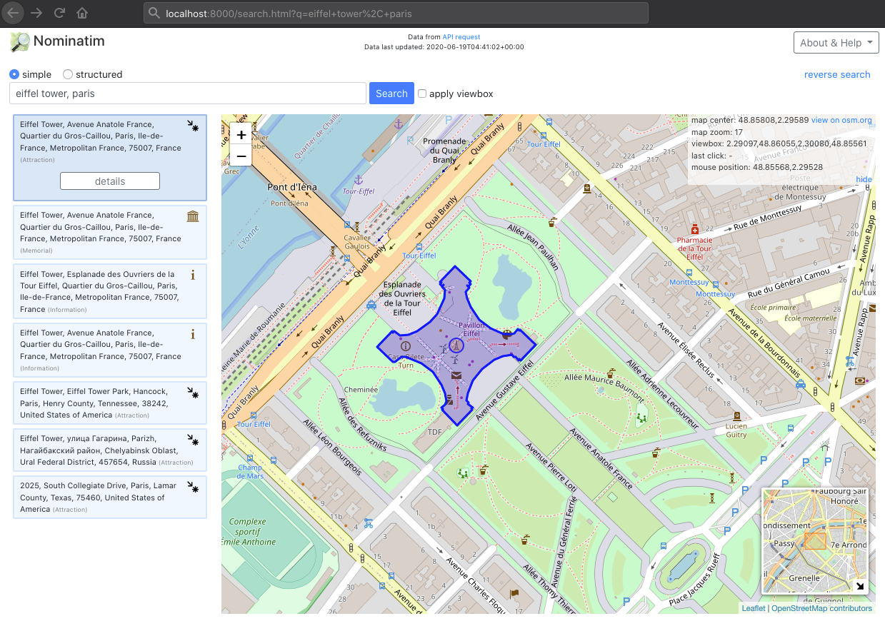

# Nominatim-UI

Debugging user interface for [Nominatim](https://nominatim.org/)
([source](https://github.com/osm-search/Nominatim/)) geocoder.

The frontend runs standalone as website and will request data
from a separate Nominatim API running on http://localhost:80/nominatim/ (configurable, see below).

Download a stable release from [https://github.com/osm-search/nominatim-ui/releases](https://github.com/osm-search/nominatim-ui/releases).
For technical background, how to develop and create a release see [CONTRIBUTE.md](CONTRIBUTE.md) file at [https://github.com/osm-search/nominatim-ui/](https://github.com/osm-search/nominatim-ui).

## Starting the frontend

You can either

* open the `dist` directory in your browser.

* if you have Python installed (part of the Nominatim API server installation):

   1. `cd dist`
   2. start webserver `python3 -m http.server 8765` 
   3. open [http://localhost:8765/]() in your browser

* start a webserver using ([Big list of http static server one-liners](https://gist.github.com/willurd/5720255)) or configure Apache, nginx or other webservers to serve the `dist` directory.

## Configuration

You can customize your installation by creating and editing `dist/theme/config.theme.js` which allows you to override the default values provided by `dist/config.default.js`. See the `config.theme.js.example` in the same directory for examples.

The `dist/theme/` directory also contains files make it easy to set a different
logo image, colors, welcome and help text.

## License

The source code is available under a [GPLv2 license](LICENSE).
